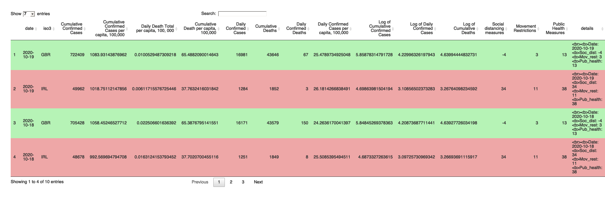

<!-- README.md is generated from README.Rmd. Please edit that file -->

# covid19BFI package

<!-- badges: start -->

[](https://github.com/etc5523-2020/r-package-assessment-samuellyu-2021/actions)
<!-- badges: end -->

The R package *covid19BFI* is a container for the *Covid19: The Battle
for Independence* application that provides access to an interactive and
insightful application for comparative analysis between Ireland and the
United Kingdom over the impact of corona virus and the response to deal
with pandemic from each government. Corona virus has further reignited
the discussion for Irish independence, given Ireland is split into two
states - The republic of Ireland and Northern Ireland, there is now a
direct case study with corona virus response as the proxy for Ireland’s
ability to stand completely united and independent of the UK, with this
package providing access to the application that hands the user the data
and the tools to make critically assess the responses between the two
countries as well, as access the data and other tools to recreate the
analysis.

## Installation

You can install the **development** version from
[GitHub](https://github.com/etc5523-2020/r-package-assessment-samuellyu-2021)
with:

``` r
# install.packages("devtools")
devtools::install_github("etc5523-2020/r-package-assessment-samuellyu-2021")
```

## Accessing the application

### The application *Covid19: The Battle for Independence* can be accessed by using **launch\_app( )** in the console after installing the package.

launch\_app( ) will build and generate the interactive shiny
application, providing user access immediately.

## Package data and tools

*covid19BFI* provides access to the data used to create the *Covid19:
The Battle for Independence* application as well as tools to explore
this, and any, dataset. Calling **covid\_data\_uk\_irl** will provide
the covid cases and deaths data that has been compiled for Ireland and
the United Kingdom. In order to further explore this dataset, simply
assign it to an object and then conduct the desired analysis. Tools that
the package provides include a **dt\_styler( )** which is datatable
style formatter that can be used with any two variables from any
dataset.

``` r
library(covid19BFI)
library(tidycovid19)
library(dplyr)
#> 
#> Attaching package: 'dplyr'
#> The following objects are masked from 'package:stats':
#> 
#>     filter, lag
#> The following objects are masked from 'package:base':
#> 
#>     intersect, setdiff, setequal, union
library(covdata)
#> 
#> Attaching package: 'covdata'
#> The following object is masked from 'package:datasets':
#> 
#>     uspop
library(tibble)
options(digits = 2)
data <- covid_data_uk_irl %>% 
  arrange(desc(date)) %>%
  head(n=10)

#Can use dt_styler to format the data according to key the specified key variables
dt_styler(data,"iso3", "GBR", "IRL", "#b6f3b6", "#eea7a7", plength = 4, rownames = FALSE)
```



As shown, **dt\_styler( )** colors the rows according to the two key
variables in the index column.

## Learn more about **covid19BFI**

  - The vignette provides further in depth explanation of the what the
    package provides as well as documentation for all the functions,
    tools and data.
